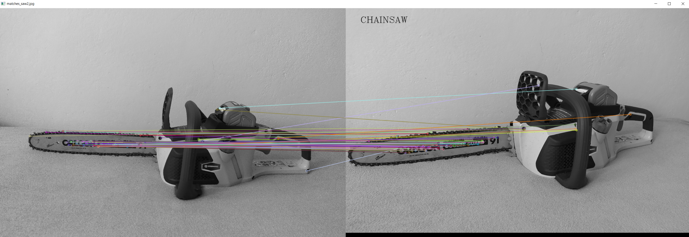
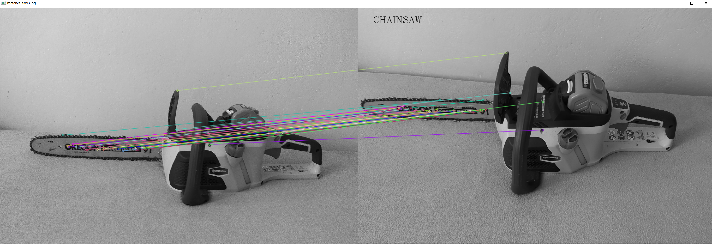
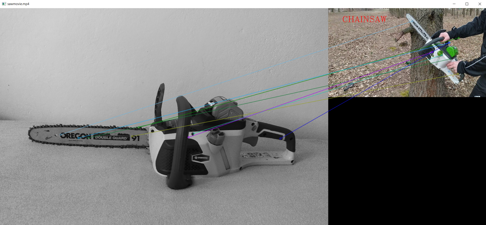

# 🌲 Chainsaw Detection Project

## Overview 📖

The Chainsaw Detection Project is a computer vision application designed to detect chainsaws 🪚 in images and videos. It leverages the OpenCV library, specifically using the ORB (Oriented FAST and Rotated BRIEF) algorithm for feature detection and the Brute Force matcher for feature matching. This project is intended for educational and demonstrational purposes in the field of object detection and image processing.

## Installation 💻

To run this project, you will need Python and OpenCV installed on your machine.

1. **Python**: Ensure you have Python installed. You can download it from python.org.
2. **OpenCV**: Install OpenCV for Python. This can be done using pip:

```
   pip install opencv-python
```
## Usage 🛠️

To use this project, follow these steps:

1. **Run the Script**:
   - Execute the main Python script. It will process each image and video in the specified directory and display or save the results.

OR

1. **Prepare Your Dataset**:
   - If you would like to use your own dataset, please place your training image (an image of a chainsaw) in a "resources/saw/train" directory.
   - Place the images and videos you want to test in a separate directory - "resources/saw".

2. **Update File Paths**:
   - In the main script, update the path to the training image and the directory containing test images and videos.

3. **Run the Script**:
   - Execute the main Python script. It will process each image and video in the specified directory and display or save the results.

  ```
   python chainsaw_detector.py
  ```
## Project Structure 📁

- `chainsaw_detector.py`: The main script containing the chainsaw detection logic.
- `resources/`: Directory containing the training image and test images/videos.

## How It Works 🔍

- The script uses ORB to detect and compute keypoints and descriptors in both the training image and the target images/videos.
- A Brute Force matcher is used to find matches between these keypoints.
- Good matches are filtered using Lowe's ratio test.
- The number of good matches is compared against a dynamic threshold to determine the presence of a chainsaw.
- For images, results are displayed in a window; for videos, each frame is processed and displayed in real-time.

## Results 📸

Below are some examples of the chainsaw detection results. These images showcase the algorithm's ability to identify and annotate chainsaws in various images and videos:





## Notes 📝

- This project is designed for educational purposes and may not be suitable for industrial-strength chainsaw detection.
- The accuracy of detection can vary based on the quality and nature of the input images and videos.
