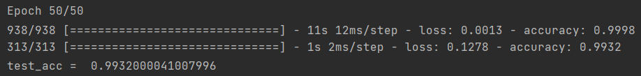
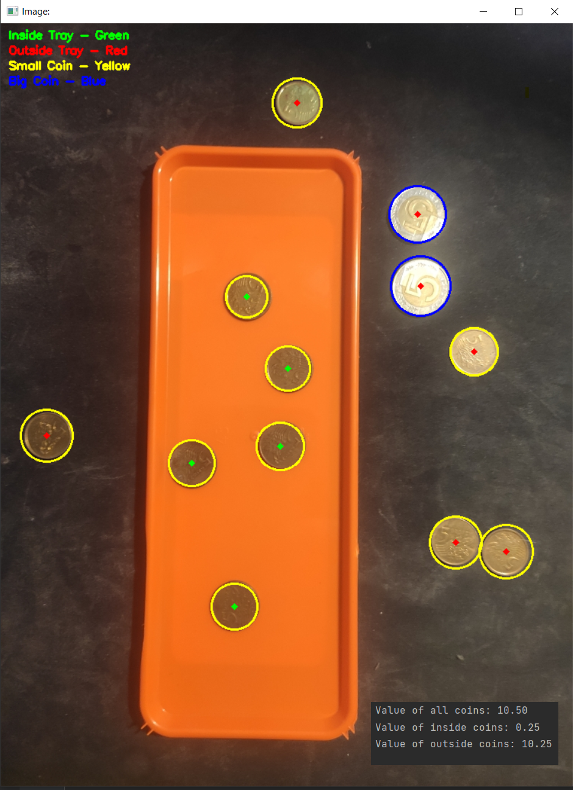

# Computer Vision Projects Collection

This repository contains a collection of computer vision projects, showcasing different applications using OpenCV in Python. Below are the projects included in this collection:
- [MNIST Handwritten Digit Classification Projects](#mnist-handwritten-digit-classification-projects)
- [Ball Detection Project](#🏀-ball-detection-project)
- [Coin Detection Project](#coin-detection-project)
- [Chainsaw Detection Project](#chainsaw-detection-project)

# MNIST Handwritten Digit Classification Projects

This repository contains two separate implementations of a neural network for classifying handwritten digits from the MNIST dataset. The first implementation is an earlier attempt, while the second demonstrates a more advanced approach with refined techniques.

## First Attempt at MNIST Classification

### Overview 📖

The initial MNIST project employs a straightforward convolutional neural network (CNN) for digit classification. This approach was chosen for its simplicity and effectiveness in image recognition tasks.

### Model Architecture 🏗️

- **Sequential Model**: Uses a stack of layers in a linear sequence. This architecture is easy to understand and implement, making it ideal for initial experiments.
- **Convolutional Layers**: Essential for capturing spatial hierarchies in image data.
- **Max-Pooling Layers**: Reduce the spatial dimensions, helping to decrease computational load and overfitting.
- **Dense Layers**: Final classification is performed using dense layers, with softmax activation to output probabilities for each digit class.

### Training Process 🏋️‍♂️

- **Optimizer**: RMSprop was chosen for its efficiency in handling mini-batches of data.
- **Epochs and Batch Size**: Set to 50 epochs and a batch size of 64, balancing training time and model performance.

### Saving the Model 💾

- **Format**: The model is saved in a default format for simplicity.

### Evaluation 📊

- **Test Dataset**: The model's performance is evaluated on a separate test set to estimate its accuracy on unseen data.

### Result 📸

Below is a result of the first attempt at MNIST classification:



---

## Second Attempt at MNIST Classification

### Overview 📖

The second attempt enhances the model with dropout, data augmentation, and callbacks. These additions aim to improve model robustness and prevent overfitting.

### Model Architecture 🏗️

- **Dropout**: Included to reduce overfitting by randomly dropping units from the neural network during training.
- **Convolutional and Max-Pooling Layers**: Retained from the first model due to their effectiveness.
- **Dense Layers**: Continued use for final classification.

### Data Augmentation and Preparation 🎨

- **ImageDataGenerator**: Introduced to augment training data by applying random transformations, thus creating a more diverse and challenging dataset. This helps the model generalize better to new data.

### Training Process with Callbacks 🏋️‍♂️

- **Optimizer**: Switched to Adam for its adaptive learning rate capabilities, making it more effective in converging to the optimal solution.
- **Early Stopping**: Monitors validation loss and stops training when it stops improving, preventing overfitting and saving computational resources.
- **Model Checkpoint**: Saves the best version of the model based on validation loss, ensuring that the most effective model is retained.

### Saving and Evaluating the Model 💾📊

- **H5 Format**: The model is saved in the H5 format, which is a more versatile and widely used format in the Keras community.
- **Evaluation**: The model is evaluated on the test dataset, providing a measure of its performance on unseen data.

### Result 📸

Below is a result of the second attempt at MNIST classification:


### Key Differences:

- **Model Complexity**: The second model is more complex with the inclusion of dropout.
- **Data Handling**: The introduction of data augmentation in the second attempt significantly changes how the model learns from the dataset.
- **Training Strategy**: The use of callbacks in the second attempt shows a more nuanced approach to training, focusing on efficiency and performance.
- **Optimizer Choice**: The shift from RMSprop to Adam reflects a more advanced understanding of optimizers.
- **Model Saving**: The transition to the H5 format in the second model aligns with best practices for model preservation and sharing.

### Conclusion:

The evolution from the first to the second attempt at MNIST classification illustrates significant growth in the application of neural networks. It showcases a journey from a basic understanding of CNNs to a more sophisticated approach, employing techniques to enhance model performance and generalization.

---

# 🏀 Ball Detection Project

## Overview 📖

The Ball Detection Project is designed to identify and locate a red ball in both still images and video streams using OpenCV in Python. This project demonstrates the application of image processing techniques like color space transformation, contour detection, and object tracking to detect a specific object in diverse settings.

## Installation 💻

To run this project, you will need Python and OpenCV installed on your machine.

1. **Python**: Ensure Python is installed. [Download Python](https://www.python.org/downloads/).
2. **OpenCV**: Install OpenCV for Python using pip:

```
pip install opencv-python
```

## Usage 🛠️

To use this project, follow these steps:

1. **Run the Script**:
   - Execute the main Python script. It will process each image and video in the specified directory and display or save the results.
OR

1. **Prepare Your Dataset**:
- If you would like to use your own dataset, please place an image and a video of a red ball in a directory. Ensure the ball is clearly visible and predominantly red.

2. **Update File Paths**:
- In the script, update the paths to your image and video files.

3. **Run the Script**:
- Execute the script to process the image and video, detecting the red ball.

## Project Structure 📁

- `ball_detector.py`: The main script for detecting the red ball in images and videos.
- `resources/`: Directory containing the test image and video.

## How It Works 🔍

- The script converts the image/video frames to the HSV color space to better isolate the color of the ball.
- A mask is created to filter out colors that are not similar to the red of the ball.
- Contour detection is used to identify the outline of the ball.
- The largest contour is assumed to be the ball, and its position and size are calculated.
- The detected ball is highlighted in the output image/video.

## Results 📸

Below are some examples of the ball detection results. These images and video frames showcase the algorithm's ability to track a red ball:


...

## Notes 📝

- This project is specifically tuned for detecting red balls. Adjustments may be needed for balls of different colors or under varying lighting conditions.
- The accuracy of detection can vary based on the quality of the image/video and the presence of other objects with similar colors.

---

## 💰 Coin Detection Project

### Overview 📖

The Coin Detection Project is a computer vision application designed to detect and evaluate coins on a tray using image recognition. It leverages OpenCV for processing images, detecting edges, circles, and distinguishing coins based on their sizes. This project provides a practical implementation of image processing techniques for object detection and value calculation.

### Installation 💻

To run this project, you will need Python and OpenCV installed on your machine.

1. **Python**: Ensure Python is installed. [Download Python](https://www.python.org/downloads/).
2. **OpenCV**: Install OpenCV for Python using pip:

```
pip install opencv-python
```

### Usage 🛠️

To use this project, follow these steps:

1. **Run the Script**:
   - Execute the main Python script. It will process each image in the specified directory and display or save the results.

OR

1. **Prepare Your Dataset**:
- If you would like to use your own dataset, please place your training image (an images of a trays and money) in a "resources/trays" directory.
- Place images of trays with coins in a directory.

2. **Update File Paths**:
- In the script, update the path to the directory containing your images.

3. **Run the Script**:
- Execute the script to process each image and display the coin detection results.

### Project Structure 📁

- `coin_detector.py`: The main script for detecting and evaluating coins.
- `resources/trays/`: Directory containing the images of trays with coins.

### How It Works 🔍

- The script processes each image to detect edges and circles, which correspond to coins.
- It identifies the tray's edges and uses this to determine whether coins are inside or outside the tray.
- Coins are categorized as small or big based on their radius, and their values are calculated accordingly.
- The total value of coins, both inside and outside the tray, is calculated and displayed.
- A legend is added to each processed image for easy understanding of the visualization.

### Results 📸

Below are some examples of the coin detection results. These images showcase the algorithm's ability to detect coins and calculate their total value:



...

### Notes 📝

- This project is designed for educational purposes and may not accurately detect coins under different lighting conditions or with overlapping coins.
- The accuracy of the value calculation depends on the distinction between small and big coins, which is based on their radius.

---

## 🌲 Chainsaw Detection Project

### Overview 📖

The Chainsaw Detection Project is a computer vision application designed to detect chainsaws 🪚 in images and videos. It leverages the OpenCV library, specifically using the ORB (Oriented FAST and Rotated BRIEF) algorithm for feature detection and the Brute Force matcher for feature matching. This project is intended for educational and demonstrational purposes in the field of object detection and image processing.

## Installation 💻

To run this project, you will need Python and OpenCV installed on your machine.

1. **Python**: Ensure you have Python installed. You can download it from python.org.
2. **OpenCV**: Install OpenCV for Python. This can be done using pip:

```
   pip install opencv-python
```
### Usage 🛠️

To use this project, follow these steps:

1. **Run the Script**:
   - Execute the main Python script. It will process each image and video in the specified directory and display or save the results.

OR

1. **Prepare Your Dataset**:
   - If you would like to use your own dataset, please place your training image (an image of a chainsaw) in a "resources/saw/train" directory.
   - Place the images and videos you want to test in a separate directory - "resources/saw".

2. **Update File Paths**:
   - In the main script, update the path to the training image and the directory containing test images and videos.

3. **Run the Script**:
   - Execute the main Python script. It will process each image and video in the specified directory and display or save the results.

  ```
   python chainsaw_detector.py
  ```
### Project Structure 📁

- `chainsaw_detector.py`: The main script containing the chainsaw detection logic.
- `resources/`: Directory containing the training image and test images/videos.

### How It Works 🔍

- The script uses ORB to detect and compute keypoints and descriptors in both the training image and the target images/videos.
- A Brute Force matcher is used to find matches between these keypoints.
- Good matches are filtered using Lowe's ratio test.
- The number of good matches is compared against a dynamic threshold to determine the presence of a chainsaw.
- For images, results are displayed in a window; for videos, each frame is processed and displayed in real-time.

### Results 📸

Below are some examples of the chainsaw detection results. These images showcase the algorithm's ability to identify and annotate chainsaws in various images and videos:


### Notes 📝

- This project is designed for educational purposes and may not be suitable for industrial-strength chainsaw detection.
- The accuracy of detection can vary based on the quality and nature of the input images and videos.
